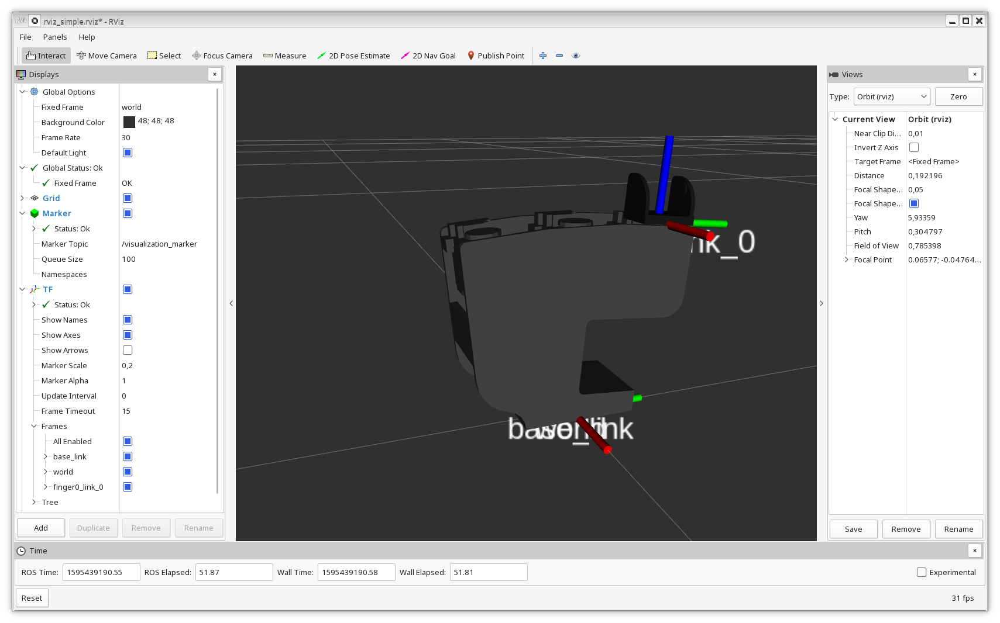

# simple_robot

This repository contains an example of limation of the physics engine of
gazebo.

If you clone it and create a catkin_ws try:

#### Run a rviz to see that the urdf is correct and you can move the joint

```
$ roslaunch simple_robot_description rviz_simple.launch

```



#### Run a gazebo, and you will see that something is wrong

```
$ roslaunch simple_robot_gazebo simple_robot_gazebo.launch 

```


In this case, if you play the simulation or the joint_link  appears in the origin,
or after some seconds the simulation colapse and then goes to origin.


Some one you know what is wrong?
